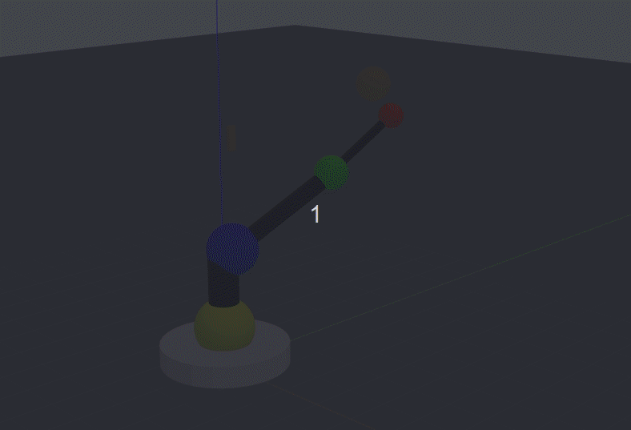

## Sphere Follower Robot
### Theodor Amariucai
#### I started the project with Sonia Marshall as part of our coursework for INFR09019 Introduction to Vision and Robotics. I then kept working on the project until I brought it from the state documented in folder 'Initial Assignment' up to the present state.
#### A very useful resource which helped me understand the Denavit-Hartenberg parameters was the Robotic Arm Kinematic GUI (part of MRPT).

#### Before anything, make sure you:
source devel/setup.sh

#### Launch controller straight away:
roslaunch sphere-follower-robot control.launch

#### Launch the basic project:
roslaunch sphere-follower-robot spawn.launch

#### Run code on the basic project:
##### Activate temporary python environment with Python 2.7 needed for ROS
source temp-python/bin/activate
##### For basic functionality please run:
rosrun sphere-follower-robot BlobsEstimator.py
rosrun sphere-follower-robot TargetEstimator.py
rosrun sphere-follower-robot JointAnglesEstimator.py 
##### To move the robot, please run:
rosrun sphere-follower-robot Controller.py
##### To get the results of forward kinematics, please run:
rosrun sphere-follower-robot ForwardKinematics.py 

#### Manually move the robot:
rostopic pub -1 /robot/joint1_position_controller/command std_msgs/Float64 “data: 1.0”

#### Produce graphs or the target estimates:
For each one, run the command, click on the arrow button to set axes (choose around 50 seconds) and save as an image.
- rqt_plot /target_position_estimate/data[0] /target/x_position_controller/command/data
- rqt_plot /target_position_estimate/data[1] /target/y_position_controller/command/data
- rqt_plot /target_position_estimate/data[2] /target/z_position_controller/command/data

#### Produce graphs for control accuracy:
- rqt_plot /target_position_estimate/data[0] /blobs_pos/data[9]
- rqt_plot /target_position_estimate/data[1] /blobs_pos/data[10]
- rqt_plot /target_position_estimate/data[2] /blobs_pos/data[11]

## Sphere Follower Robot Demo, recoded in Gazebo

